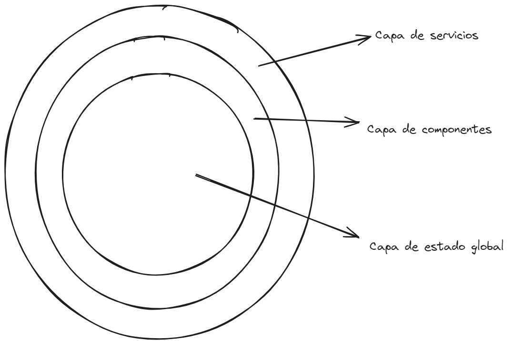

# Helpers en JavaScript

Los helpers son funciones que se utilizan para realizar tareas comunes en una aplicación. En nuestra app SPA (Single Page Application) podemos tener helpers para realizar tareas como formatear fechas, manejar errores, realizar peticiones HTTP, etc.

## Crear un helper

Para crear un helper en JavaScript, simplemente se define una función que realice la tarea deseada y se exporta para que pueda ser utilizada en otros módulos. Por ejemplo, vamos a crear un helper para formatear fechas:

```javascript
// Helper para formatear fechas
export function formatDate(date) {
  const options = { year: "numeric", month: "long", day: "numeric" };
  return new Date(date).toLocaleDateString("es-ES", options);
}
```

En este ejemplo, la función `formatDate` recibe una fecha y la formatea en formato `día de la semana, día de mes de año`. Luego, se exporta la función para que pueda ser utilizada en otros módulos. El archivo que contiene el helper se puede llamar `dateHelper.js` y lo ubicamos en una carpeta `helpers` en la raiz de nuestro proyecto.

## Importar un helper

Para utilizar un helper en otro módulo, simplemente se importa la función del helper y se llama en el código donde se necesite. Por ejemplo, si queremos utilizar el helper `formatDate` en un componente de nuestra app, podemos importarlo de la siguiente manera:

```javascript
import { formatDate } from "./helpers/dateHelper.js";

const date = "2024-01-01";
const formattedDate = formatDate(date);
console.log(formattedDate); // Output: "sábado, 1 de enero de 2024"
```

En este ejemplo, importamos la función `formatDate` del helper `dateHelper.js` y la utilizamos para formatear una fecha. Luego, imprimimos el resultado en la consola.

## A continuacion, te dejare 25 ejemplos de helpers que puedes utilizar en tu aplicacion:

1. Helper para formatear fechas

```javascript
// Helper para formatear fechas
export function formatDate(date) {
  const options = { year: "numeric", month: "long", day: "numeric" };
  return new Date(date).toLocaleDateString("es-ES", options);
}
```

Como vimos en el ejemplo anterior, este helper recibe una fecha y la formatea en formato `día de la semana, día de mes de año`.

2. Helper para manejar errores

```javascript
// Helper para manejar errores
export function handleError(error) {
  console.error(error);
  alert("Ha ocurrido un error. Por favor, inténtalo de nuevo más tarde.");
}
```

Este tipo de helper es demasiado util para manejar errores en nuestra aplicacion. Pensemos por un momento en una arquitectura por capas como una cebolla, donde la capa mas externa es la capa de servicios, luego la capa de componentes y por ultimo la capa del estado global de la aplicacion como la siguiente imagen:



En la capa de servicios, es donde se manejan las peticiones HTTP, por lo que es el lugar ideal para manejar errores. Si ocurre un error en una peticion, simplemente se llama a la funcion `handleError` y se muestra un mensaje al usuario.

Veamos un ejemplo de como se puede utilizar este helper en un archivo de servicios (entiendase por servicios a las funciones que realizan peticiones HTTP, las cuales por lo general aislamos en archivos separados):

```javascript

// services/dataService.js
import { handleError } from "./helpers/errorHelper.js";

export async function fetchData() {
  try {
    const response = await fetch("https://api.example.com/data");
    const data = await response.json();
    return data;
  } catch (error) {
    handleError(error);
  }
}
```

En este ejemplo, la funcion `fetchData` realiza una peticion HTTP a una API y maneja cualquier error que pueda ocurrir utilizando el helper `handleError`, que si recordamos, muestra un mensaje de error al usuario a travess de un `alert`, la cual, como ya sabemos, es una funcion que muestra un mensaje en una ventana emergente y detiene la ejecucion del codigo hasta que el usuario haga clic en el boton de aceptar. Esto nos es particularmente util para manejar errores de forma sencilla y rapida globalmente en nuestra aplicacion.

3. Helper para realizar peticiones HTTP

```javascript

// Helper para realizar peticiones HTTP
export async function fetchApi(url, options) {
  try {
    const response = await fetch(url, options);
    const data = await response.json();
    return data;
  } catch (error) {
    handleError(error);
  }
}
```

Yo se! Se parece mucho a la funcion `fetchData` que acabamos de ver, pero la diferencia radica en que esta funcion es mas generica y puede ser utilizada para realizar cualquier tipo de peticion HTTP, ya sea un GET, POST, PUT, DELETE, etc. Ademas, recibe dos parametros: `url` y `options`, donde `url` es la URL de la API a la que se va a realizar la peticion y `options` son las opciones de configuracion de la peticion, como el metodo HTTP, los headers, el body, etc.

Veamos un ejemplo de como se puede utilizar este helper en un archivo de servicios:

```javascript

// services/dataService.js
import { fetchApi } from "./helpers/httpHelper.js";

export async function fetchData() {
  const url = "https://api.example.com/data";
  const options = {
    method: "GET",
    headers: {
      "Content-Type": "application/json",
    },
  };

  return fetchApi(url, options);
}
```

En este ejemplo, la funcion `fetchData` utiliza el helper `fetchApi` para realizar una peticion GET a la URL `https://api.example.com/data` con los headers `Content-Type: application/json`. La respuesta de la peticion se devuelve como una promesa, por lo que se puede utilizar `async/await` para esperarla y manejarla de forma asincrona.

4. Helper para validar formularios

```javascript

// Helper para validar formularios
export function validateForm(formData) {
  const errors = {};

  if (!formData.name) {
    errors.name = "El nombre es obligatorio";
  }

  if (!formData.email) {
    errors.email = "El correo electrónico es obligatorio";
  } else if (!isValidEmail(formData.email)) {
    errors.email = "El correo electrónico no es válido";
  }

  return errors;
}

function isValidEmail(email) {
  const emailRegex = /^[^\s@]+@[^\s@]+\.[^\s@]+$/; // Significa: cualquier caracter que no sea un espacio o un arroba, seguido de un arroba, seguido de cualquier caracter que no sea un espacio o un arroba, seguido de un punto, seguido de cualquier caracter que no sea un espacio o un arroba
  return emailRegex.test(email);
}
```

Este helper recibe un objeto `formData` con los datos de un formulario y valida que los campos `name` y `email` no esten vacios. Ademas, valida que el campo `email` tenga un formato de correo electronico valido utilizando una expresion regular. Si alguno de los campos no cumple con las validaciones, se devuelve un objeto `errors` con los mensajes de error correspondientes.

Veamos un ejemplo de como se puede utilizar este helper en un custom web component de nuestra SPA:

```javascript

// components/formComponent.js
import { validateForm } from "./helpers/formHelper.js";

export const ContactFormComponent = () => {
    const root = document.getElementById("root");
    const form = document.createElement("form");

    form.addEventListener("submit", (event) => {
        event.preventDefault();
        const formData = {
            name: form.name.value,
            email: form.email.value,
        };
        const errors = validateForm(formData);
        if (Object.keys(errors).length === 0) {
            // Enviar datos del formulario
        } else {
            // Mostrar mensajes de error
        }
    });

    form.innerHTML = `
        <input type="text" name="name" placeholder="Nombre">
        <input type="email" name="email" placeholder="Correo electrónico">
        <button type="submit">Enviar</button>
    `;

    root.appendChild(form);
}
```

5. Helper para formatear números

```javascript

// Helper para formatear números
export function formatNumber(number) {
  return new Intl.NumberFormat("es-ES").format(number);
}
```

Este helper recibe un número y lo formatea con el formato de separador de miles y decimales de España (`,`). Por ejemplo, si se pasa el número `1234567.89`, se devuelve `1.234.567,89`.
Intl es un objeto incorporado en JavaScript que proporciona soporte para formatear números, fechas y cadenas de texto en diferentes idiomas y regiones.

6. Helper para formatear moneda

```javascript

// Helper para formatear moneda

export function formatCurrency(amount, currency) {
  return new Intl.NumberFormat("es-ES", {
    style: "currency",
    currency: currency,
  }).format(amount);
}
```

Este helper recibe un monto y una moneda y lo formatea con el formato de moneda correspondiente. Por ejemplo, si se pasa el monto `1234.56` y la moneda `EUR`, se devuelve `1.234,56 €`.

7. Helper para generar códigos aleatorios

```javascript

// Helper para generar códigos aleatorios
export function generateRandomCode(length) {
  const characters = "ABCDEFGHIJKLMNOPQRSTUVWXYZ0123456789";
  let code = "";

  for (let i = 0; i < length; i++) {
    const randomIndex = Math.floor(Math.random() * characters.length);
    code += characters[randomIndex];
  }

  return code;
}
```

Este helper recibe una longitud y genera un código aleatorio con los caracteres `A-Z` y `0-9`. Por ejemplo, si se pasa una longitud de `6`, se devuelve un código aleatorio de 6 caracteres como `AB3C9F`.

8. Helper para copiar texto al portapapeles

```javascript

// Helper para copiar texto al portapapeles
export function copyToClipboard(text) {
  const textarea = document.createElement("textarea");
  textarea.value = text;
  document.body.appendChild(textarea);
  textarea.select();
  document.execCommand("copy");
  document.body.removeChild(textarea);
}
```

Este helper recibe un texto y lo copia al portapapeles del usuario. Para ello, crea un elemento `textarea`, le asigna el texto, lo agrega al cuerpo del documento, lo selecciona y ejecuta el comando `copy`. Luego, elimina el elemento `textarea`.

9. Helper para obtener la edad a partir de una fecha de nacimiento

```javascript

// Helper para obtener la edad a partir de una fecha de nacimiento

export function getAge(birthDate) {
  const today = new Date();
  const birth = new Date(birthDate);
  let age = today.getFullYear() - birth.getFullYear();
  const month = today.getMonth() - birth.getMonth();

  if (month < 0 || (month === 0 && today.getDate() < birth.getDate())) {
    age--;
  }

  return age;
}
```

Este helper recibe una fecha de nacimiento y calcula la edad actual en base a la fecha actual. Por ejemplo, si se pasa la fecha de nacimiento `1990-01-01`, se devuelve la edad `34` si la fecha actual es `2024-01-01`.

10. Helper para ordenar una lista de objetos por una propiedad

```javascript

// Helper para ordenar una lista de objetos por una propiedad

export function sortByProperty(list, property, order = "asc") {
  return list.sort((a, b) => {
    if (order === "asc") {
      return a[property] > b[property] ? 1 : -1;
    } else {
      return a[property] < b[property] ? 1 : -1;
    }
  });
}
```

Este helper recibe una lista de objetos, una propiedad y un orden (`asc` o `desc`) y ordena la lista de objetos por la propiedad especificada. Por ejemplo, si se pasa la lista de objetos `[{ name: "Alice", age: 30 }, { name: "Bob", age: 25 }]`, la propiedad `name` y el orden `asc`, se devuelve la lista ordenada por nombre de forma ascendente.

11. Helper para filtrar una lista de objetos por una propiedad

```javascript

// Helper para filtrar una lista de objetos por una propiedad

export function filterByProperty(list, property, value) {
  return list.filter((item) => item[property] === value);
}
```

Este helper recibe una lista de objetos, una propiedad y un valor, y filtra la lista de objetos por la propiedad y el valor especificados. Por ejemplo, si se pasa la lista de objetos `[{ name: "Alice", age: 30 }, { name: "Bob", age: 25 }]`, la propiedad `age` y el valor `30`, se devuelve la lista filtrada con el objeto `{ name: "Alice", age: 30 }`.

12. Helper para paginar una lista de objetos

```javascript

// Helper para paginar una lista de objetos

export function paginateList(list, page, pageSize) {
  const startIndex = (page - 1) * pageSize;
  const endIndex = startIndex + pageSize;
  return list.slice(startIndex, endIndex);
}
```

Este helper recibe una lista de objetos, un número de página y un tamaño de página, y devuelve una porción de la lista paginada. Por ejemplo, si se pasa la lista de objetos `[{ name: "Alice" }, { name: "Bob" }, { name: "Charlie" }]`, la página `2` y el tamaño de página `1`, se devuelve el objeto `{ name: "Bob" }`.

Veamos un ejemplo real de paginacion en una aplicacion SPA:

```javascript

// components/paginationComponent.js
import { paginateList } from "./helpers/paginationHelper.js";

export const PaginationComponent = (list, pageSize) => {
    const root = document.getElementById("root");
    let currentPage = 1;

    const renderPage = () => {
        const page = paginateList(list, currentPage, pageSize);
        // Renderizar la pagina en el DOM
    };

    const nextPage = () => {
        currentPage++;
        renderPage();
    };

    const prevPage = () => {
        currentPage--;
        renderPage();
    };

    renderPage();

    return {
        nextPage,
        prevPage,
    };
}
```

En este ejemplo, el componente `PaginationComponent` recibe una lista de objetos y un tamaño de página, y renderiza la página actual en el DOM. Además, proporciona métodos para navegar a la página siguiente y anterior.

13. Helper para calcular el promedio de una lista de números

```javascript

// Helper para calcular el promedio de una lista de números

export function calculateAverage(numbers) {
  const sum = numbers.reduce((acc, number) => acc + number, 0);
  return sum / numbers.length;
}
```

Este helper recibe una lista de números y calcula el promedio de los mismos. Por ejemplo, si se pasa la lista de números `[1, 2, 3, 4, 5]`, se devuelve el promedio `3`.

14. Helper para convertir una cadena de texto a slug

```javascript

// Helper para convertir una cadena de texto a slug

export function textToSlug(text) {
  return text
    .toLowerCase()
    .replace(/ /g, "-")
    .replace(/[^a-z0-9-]/g, "");
}
```

Este helper recibe una cadena de texto y la convierte en un slug, es decir, una cadena de texto en minúsculas con guiones en lugar de espacios y sin caracteres especiales. Por ejemplo, si se pasa la cadena de texto `Hello, World!`, se devuelve el slug `hello-world`.

15. Helper para capitalizar una cadena de texto

```javascript

// Helper para capitalizar una cadena de texto

export function capitalizeText(text) {
  return text.charAt(0).toUpperCase() + text.slice(1).toLowerCase();
}
```

Este helper recibe una cadena de texto y la capitaliza, es decir, pone la primera letra en mayúscula y el resto en minúscula. Por ejemplo, si se pasa la cadena de texto `hello, world!`, se devuelve `Hello, world!`.

16. Helper para validar un número de teléfono

```javascript

// Helper para validar un número de teléfono

export function isValidPhoneNumber(phoneNumber) {
  const phoneRegex = /^\+(?:[0-9] ?){6,14}[0-9]$/; // Significa: un signo de mas seguido de 6 a 14 digitos numericos seguidos de un digito numerico
  return phoneRegex.test(phoneNumber);
}
```

Este helper recibe un número de teléfono y valida que tenga un formato internacional válido. Por ejemplo, si se pasa el número de teléfono `+1234567890`, se devuelve `true`.

17. Helper para crear un snackbar global con transicion slide, fade o bounce

```javascript

// Helper para crear un snackbar global con transicion slide, fade o bounce

export function showSnackbar(message, type = "info", transition = "slide") {
  const snackbar = document.createElement("div");
  snackbar.classList.add("snackbar", `snackbar-${type}`, `snackbar-${transition}`);
  snackbar.textContent = message;
  document.body.appendChild(snackbar);

  setTimeout(() => {
    snackbar.remove();
  }, 3000);
}
```

Te preguntaras, ¿Que es un snackbar? Un snackbar es un componente de interfaz de usuario que se utiliza para mostrar mensajes breves al usuario, como confirmaciones, advertencias o errores. En este caso, el helper `showSnackbar` recibe un mensaje, un tipo (`info`, `success`, `warning`, `error`) y una transición (`slide`, `fade`, `bounce`) y crea un snackbar global en el cuerpo del documento con el mensaje y la apariencia especificados. Luego, elimina el snackbar después de 3 segundos. 

Y... en donde esta el CSS para los estilos del snackbar? Bueno, aqui te dejo un ejemplo de como podria ser:

```css

/* styles/snackbar.css */

.snackbar {
  position: fixed;
  bottom: 0;
  left: 50%;
  transform: translateX(-50%);
  padding: 16px;
  background-color: #333;
  color: #fff;
  border-radius: 4px;
  box-shadow: 0 2px 4px rgba(0, 0, 0, 0.1);
  transition: transform 0.3s ease;
}

.snackbar-info {
  background-color: #007bff;
}

.snackbar-success {
  background-color: #28a745;
}

.snackbar-warning {
  background-color: #ffc107;
}

.snackbar-error {
  background-color: #dc3545;
}

.snackbar-slide {
  transform: translateY(100%);
}

.snackbar-fade {
  opacity: 0;
}

.snackbar-bounce {
  animation: bounce 0.5s;
}

@keyframes bounce {
  0%, 100% {
    transform: translateY(0);
  }
  50% {
    transform: translateY(-10px);
  }
}

@keyframes slide {
  0% {
    transform: translateY(100%);
  }
  100% {
    transform: translateY(0);
  }
}

@keyframes fade {
  0% {
    opacity: 0;
  }
  100% {
    opacity: 1;
  }
}
```

18. Helper para obtener la hora actual en formato de 12 horas

```javascript

// Helper para obtener la hora actual en formato de 12 horas

export function getCurrentTime12Hours() {
  const options = { hour: "numeric", minute: "numeric", hour12: true };
  return new Date().toLocaleTimeString("es-ES", options);
}
```

Este helper obtiene la hora actual y la formatea en formato de 12 horas con minutos y AM/PM. Por ejemplo, si se llama a la función a las `15:30`, se devuelve `3:30 PM`.

19. Helper para obtener la hora actual en formato de 24 horas

```javascript

// Helper para obtener la hora actual en formato de 24 horas

export function getCurrentTime24Hours() {
  const options = { hour: "numeric", minute: "numeric" };
  return new Date().toLocaleTimeString("es-ES", options);
}
```

Este helper obtiene la hora actual y la formatea en formato de 24 horas con minutos. Por ejemplo, si se llama a la función a las `15:30`, se devuelve `15:30`.

20. Helper para crear logs en una rchivo externo por cada peticion en el interceptor de una aplicacion SPA

```javascript

// Helper para crear logs en un archivo externo por cada peticion en el interceptor de una aplicacion SPA

export function createLog(log) {
  const logFile = new Blob([log], { type: "text/plain" });
  const logURL = URL.createObjectURL(logFile);
  const logLink = document.createElement("a");
  logLink.href = logURL;
  logLink.download = "log.txt";
  logLink.click();
}
```

Este helper recibe un log y crea un archivo de texto con el log en formato `text/plain`. Luego, crea un enlace de descarga con el archivo y lo descarga automáticamente al hacer clic en el enlace.

21. Helper para obtener la ubicacion actual del usuario

```javascript

// Helper para obtener la ubicacion actual del usuario

export function getCurrentLocation() {
  return new Promise((resolve, reject) => {
    if ("geolocation" in navigator) {
      navigator.geolocation.getCurrentPosition(
        (position) => {
          resolve(position.coords);
        },
        (error) => {
          reject(error);
        }
      );
    } else {
      reject(new Error("Geolocation is not available"));
    }
  });
}
```

Este helper utiliza la API de geolocalización del navegador para obtener la ubicación actual del usuario. Devuelve una promesa que se resuelve con las coordenadas de la ubicación o se rechaza con un error si la geolocalización no está disponible.

22. Helper para convertir una cadena de texto en formato JSON

```javascript

// Helper para convertir una cadena de texto en formato JSON

export function parseJSON(text) {
  try {
    return JSON.parse(text);
  } catch (error) {
    return null;
  }
}
```

Este helper recibe una cadena de texto en formato JSON y la convierte en un objeto JavaScript. Si la cadena de texto no es válida JSON, devuelve `null`.

23. Helper para convertir un objeto en formato JSON a una cadena de texto

```javascript

// Helper para convertir un objeto en formato JSON a una cadena de texto

export function stringifyJSON(object) {
  return JSON.stringify(object);
}
```

Este helper recibe un objeto JavaScript y lo convierte en una cadena de texto en formato JSON. Por ejemplo, si se pasa el objeto `{ name: "Alice", age: 30 }`, se devuelve `{"name":"Alice","age":30}`.

24. Helper para obtener el día de la semana a partir de una fecha

```javascript

// Helper para obtener el día de la semana a partir de una fecha

export function getDayOfWeek(date) {
  const options = { weekday: "long" };
  return new Date(date).toLocaleDateString("es-CO", options);
}
```

Este helper recibe una fecha y devuelve el día de la semana correspondiente en formato largo. Por ejemplo, si se pasa la fecha `2024-01-01`, se devuelve `sábado`.

25. Helper para obtener el mes a partir de una fecha

```javascript

// Helper para obtener el mes a partir de una fecha

export function getMonth(date) {
  const options = { month: "long" };
  return new Date(date).toLocaleDateString("es-CO", options);
}
```

Este helper recibe una fecha y devuelve el mes correspondiente en formato largo. Por ejemplo, si se pasa la fecha `2024-01-01`, se devuelve `enero`.

Estos son solo algunos ejemplos de helpers que puedes utilizar en tu aplicacion SPA para realizar tareas comunes de forma sencilla y reutilizable. Puedes crear tus propios helpers para adaptarlos a las necesidades específicas de tu aplicación y mejorar la eficiencia y mantenibilidad de tu código.

